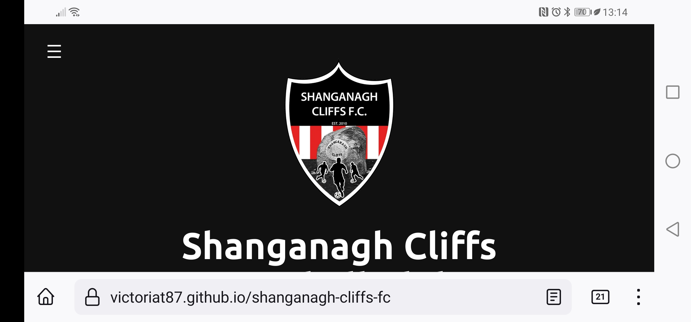

# Shanganagh Cliffs Football Club

Welcome to the Shanganagh Cliffs Football Club website! This site has been created to allow fans and community members of this small local football club in South Dublin, Ireland to see how the club started, find the latest news and fixtures and to contact the club for the purpose of signing up to play.

The website also has a contact form which will allow local businesses to get in touch with a chance to sponsor the club - a very important feature for local clubs which still rely on money paid in by the players for travel and kit expenses.

[Live link to The Shanganagh Cliffs Football Club Website](https://victoriat87.github.io/shanganagh-cliffs-fc/)

# Features 

## Existing Features

- __Navigation Bar__

  - Featured on both the main index page and the contact form page, the full responsive navigation bar includes links to each section of the Home page -  the Logo, About, News, Fixtures and the current League Table - as well as to the separate Contact Form page. This allows for easy navigation across the site.
  - Connected to the Navigation bar is a "Return to Top" button. This will show to the bottom right of the screen when the user scrolls below the header and allows the user to easily return to the Navigation menu with one button. 
  - These 2 items together allows the user to easily navigate from each section of the Index page back to the top Navigation, as well as easy access to the Contact Form page without needed to scroll back up to the top or pressing the refresh or back buttons. 
  - A hamburger menu will appear when the screen is scaled down to smaller screen sizes. This hamburger menu will open from the side with a bold red background to continue the website's color scheme.

#### Navigation on Desktop

#### Hamburger Navigation on Mobile

#### Hamburger Navigation Opened on Mobile

#### Back to The Top Button

 

- __Header__

  - The fully responsive header consists of the navigation bar, as well as the club's logo and text of the club's name.
  - The image and text will scale down for each screen size, making sure the header never takes up too much space on mobile.
  - The Logo, when clicked, will also bring the user back to the home page from the Contact page.
 

  
   

- __Hero Image__

  - The landing includes a photograph of the full team with a text overlay announcing that submissions are open to join the team for the next year. 
  - This section introduces the user to the Shanganagh Cliffs Football team. It also lets the user know that they can join the team and shows off their full kit and prominent sponsorship, to entice local businesses to sponsor the team. 

 

- __About Section__

  - The About section informs the user of how the club began, how long it's been running, the League and Division the football team is in and how to apply to join the team.
  - This user will see that the club is a successful local team, who has won a Division Championship, and that the team consists of local men from the community. This will hopefully encourage new people to join. 

 

- __Latest News section__

  - This section will allow the user to see all the latest news from the football club, including images from events, meetups and matches.
  - This section will be updated with the latest news from the club. The amount of subsections within the Latest News section can be updated to allow as much information as possible to be shown to the user. 

 

- __Fixtures Section__ 

  - The Fixtures section will show the user the latest upcoming match fixtures for the team, including the location, time and date of the next 4 matches. As each match is played on a Saturday, this should cover each month.
  - The Fixtures section is extremely valuable to fans of the club, who will know when a local match is being played, as well as matches that some users may want to travel to to show their support.

 

- __League Table__ 

  - The League Table section consists of a HTML table with columns and rows outlining the current standings, games played, goals for/against and the goal difference, as well as the points each team has.
  - Having the current table is very important for a user who is a fan of the team. Knowing the team's current position, along with the upcoming fixtures, can help a user understand better how well the team is playing and will encourage support.

- __The Footer__ 

  - The Footer section includes social media links and contact links in the form of a phone number and email address.
  - The links within the footer will allow the user direct buttons to follow the team on their social platforms and to easily get in touch with the management team for any other questions or queries.

 

- __The Contact Page__

  - This page allows the user to contact the team in regards to signing up, to apply for Sponsorship of the kit or for general queries. 
  - Featuring a large background image of an overhead drone shot of the pitch that the club plays on with the contact form overlaying it, the page is striking for the user to look at.
  - The contact page also includes an embedded Google Map to show the pitch where the team plays. This map is fully interactive, with the user able to zoom in and out and drag the map around.

 

## Features Left to Implement

- Add a Gallery to the website, consisting of images of the team playing their matches, as well as fan submitted photos of fans with the jersey and travelling to support the team.
- As well as photos, having short video clips of goals would encourage more interactivity from users of the website - both taking videos of the teams matches and submitting them for others to enjoy.

 

# User Experience (UX)

## Site Goals
The main goal of the website is to encourage more fans/members of the local community to learn more about how Shanganagh Cliffs was founded (as a community project with friends) and to let users know when and where the next matches will be played, to allow them to come and support the team.

## User Stories

* First Time Visitor Goals

  As a first time visitor: 
  * I want to understand that the website is for a local football team.
  * I want to know more about how the club was founded.
  * I want to know when and where the next match will be.
  * I want to know how where the home pitch is and how to get there.

 

* Returning Visitor Goals

    As a returning visitor:    
    * I want to know how well the team is doing in the League.
    * I want to know the latest news about the team.

 

## Design

### Colour Scheme
 -   The colour scheme is all designed around the colors of the team and their logo. The team uses red, black and white. I found these colours worked very well for contrasting each other throughout the site. Both the header and footer are black, with white text. The buttons on the site (back to the top and the submit button on the form), use the red color to stand out and catch the users attention that it is something they can interact with.

### Typography
 -   The font chosen for the website is a san-serif font called Ubuntu. This was picked because it has good clarity on both desktop and mobile screens. The font was found on [Google Font](https://fonts.google.com/specimen/Ubuntu) and imported to the website with a CSS import.

### Wireframe
 - On advice from my Mentor, my first step in creating the website was to create a wireframe using [Balsamiq](https://balsamiq.com/). Below is the image.
 
 

# Technologies

## Languages Used
* [HTML5](https://www.w3schools.com/html/)
* [CSS](https://www.w3schools.com/css/)
* [JavaScript](https://www.w3schools.com/js/)

## Libraries & Frameworks
* [Google Fonts](https://fonts.google.com/)
* [Font Awesome](https://fontawesome.com/)

## Tools & Resources
* [GitPod](https://www.gitpod.io/)
* [GitHub](https://github.com/)
* [ReadMe Template](https://github.com/Code-Institute-Solutions/readme-template)
* [PicResize](https://picresize.com/)
* [WEBP Converter](https://cloudconvert.com/webp-converter)
* [Am I Responsive](https://ui.dev/amiresponsive)
* [W3C HTML Validation](https://validator.w3.org/)
* [W3C CSS Validation](https://jigsaw.w3.org/css-validator/)
* [Lighthouse](https://web.dev/measure/)
* [Chrome DevTools](https://developer.chrome.com/docs/devtools/)
* [Flexbox](https://css-tricks.com/snippets/css/a-guide-to-flexbox/)
* [Stack Overflow](https://stackoverflow.com/)
* [Favicon.io](https://favicon.io/)

 

# Testing 
### Validator Testing 

- HTML
  - No errors were returned when passing through the official [W3C validator](https://validator.w3.org/nu/?doc=https%3A%2F%2Fcode-institute-org.github.io%2Flove-running-2.0%2Findex.html)
- CSS
  - No errors were found when passing through the official [(Jigsaw) validator](https://jigsaw.w3.org/css-validator/validator?uri=https%3A%2F%2Fvalidator.w3.org%2Fnu%2F%3Fdoc%3Dhttps%253A%252F%252Fcode-institute-org.github.io%252Flove-running-2.0%252Findex.html&profile=css3svg&usermedium=all&warning=1&vextwarning=&lang=en#css)

### Lighthouse Testing
 - When first tested, performance for the website was at 88. The recommendations from Lighthouse for this issue was to change certain images from .jpg to .webp. To do this, I used the website [WEBP Converter](https://cloudconvert.com/webp-converter). After running Lighthouse again, this changed to a 98.
 - The other recommendations Lighthouse gave me to speed up performance, was to do with the caching of images. I tried to research this issue but it was to do with the configuration of the server, and adding "Cache-Control" to the server header. As I don't have access to this, I could not change it.

 

### Other Testing
 - The website has been tested across various screen sizes, using the Chrome DevTools responsive device section and by opening the website on Firefox, Chrome, 3 various sized Android phones (Huawei P20 Lite, OnePlus 9 Pro, Samsung Galaxy S20) and an Android tablet (Samsung Galaxy Tab A8). 

  

 - Huawei P20 Lite Vertical 

- Huawei P20 Lite Horizontal

- Samsung Tab A8 Vertical

- Samsung Tab A8 Horizontal

- One Plus 9 Pro Horizontal

- One Plus 9 Pro Horizontal

- One Plus 9 Pro Vertical Hamburger Menu
 

- One Plus 9 Pro Vertical Fixtures Section

 

# Bugs Found and Fixed
- Originally, I was using divs, positioning and floats to layout all content. However, when resizing, I ran into major issues with how the content positioned itself. After discussing with my Mentor, he advised me to learn and use [Flexbox](https://css-tricks.com/snippets/css/a-guide-to-flexbox/) elements instead.

- The Hero Image, when resizing, was leaving a gap between the Header and the image itself. I had assumed this was to do with either the height on the image or the padding on the wrapper. I wrote media queries for both using Chrome DevTools but this didn't solve the issue. After trouble shooting on Stack Overflow, I noticed that my image didn't have "background-size: cover". When this was added, the image no longer had a gap when resizing.

- The Cover Text on the Hero image was positioned using floats but when resized, the text would float below the image. This was because I had originally positioned it using pixels. After changing this to % values, the cover text stayed in place when the screen was resized.

- The original code I used to make the Hamburger menu from [makeuseof.com](https://www.makeuseof.com/responsive-navigation-bar-using-html-and-css/) and [https://codepen.io/](https://codepen.io/bloom-dan/pen/vKdoaM) gave me an error when I ran it through the W3 Validation. It said "an input can't be a child of a UL".  After asking for help in the Slack Channel,  fellow student, Sean Johnson, messaged me to say he also had the same issue. After talking through his code and comparing it to mine, I realised I needed to move the Checkbox Input from under the UL to under the nav class itself. This also meant I needed to change the CSS to point to the new sibling of the menu, instead of a child of the UL.

- The layout of my Fixtures section and my League Table section, when resized, were overflowing the Flexbox. This was because I had set the height using vh units. After testing in Chrome DevTools, the solution to this issue was to change from using vh units, to using em units. 

 

## Deployment

The following are the steps I went through to deploy my live site:

- The site was deployed to GitHub pages. The steps to deploy are as follows: 
  - In the GitHub repository, navigate to the Settings tab on the top menu.
  - From the settings page, navigate to the Pages section from the left hand side menu.
  - From the source section drop-down menu, select "Deploy From a Branch"
  - Press the save button.
  - After a few minutes, you can refresh the page to see your Live Site link at the top.

The live link can be found here - https://victoriat87.github.io/shanganagh-cliffs-fc/