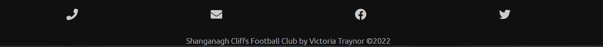

# Shanganagh Cliffs Football Club

Welcome to the Shanganagh Cliffs Football Club website! This site has been created to allow fans and community members of this small local football club in South Dublin, Ireland to see how the club started, find the latest news and fixtures and to contact the club for the purpose of signing up to play.

The website also has a contact form which will allow local businesses to get in touch with a chance to sponsor the club - a very important feature for local clubs which still rely on money paid in by the players for travel and kit expenses.

[Live link to The Shanganagh Cliffs Football Club Website](https://victoriat87.github.io/shanganagh-cliffs-fc/)

## Features 

### Existing Features

- __Navigation Bar__

  - Featured on both the main index page and the contact form page, the full responsive navigation bar includes links to each section of the Home page -  the Logo, About, News, Fixtures and the current League Table - as well as to the separate Contact Form page. This allows for easy navigation across the site.
  - Connected to the Navigation bar is a "Return to Top" button. This will show to the bottom right of the screen when the user scrolls below the header and allows the user to easily return to the Navigation menu with one button. 
  - These 2 items together allows the user to easily navigate from each section of the Index page back to the top Navigation, as well as easy access to the Contact Form page without needed to scroll back up to the top or pressing the refresh or back buttons. 
  - A hamburger menu will appear when the screen is scaled down to smaller screen sizes. This hamburger menu will open from the side with a bold red background to continue the website's color scheme.

#### Navigation on Desktop

#### Hamburger Navigation on Mobile

#### Back to The Top Button

 

- __Header__

  - The fully responsive header consists of the navigation bar, as well as the club's logo and text of the club's name.
  - The image and text will scale down for each screen size, making sure the header never takes up too much space on mobile.
  - The Logo, when clicked, will also bring the user back to the home page from the Contact page.
 
 #### Header

  
   

- __Hero Image__

  - The landing includes a photograph of the full team with a text overlay announcing that submissions are open to join the team for the next year. 
  - This section introduces the user to the Shanganagh Cliffs Football team. It also lets the user know that they can join the team and shows off their full kit and prominent sponsorship, to entice local businesses to sponsor the team. 

 

- __About Section__

  - The About section informs the user of how the club began, how long it's been running, the League and Division the football team is in and how to apply to join the team.
  - This user will see that the club is a successful local team, who has won a Division Championship, and that the team consists of local men from the community. This will hopefully encourage new people to join. 

 

- __Latest News section__

  - This section will allow the user to see all the latest news from the football club, including images from events, meetups and matches.
  - This section will be updated with the latest news from the club. The amount of subsections within the Latest News section can be updated to allow as much information as possible to be shown to the user. 

 

- __Fixtures Section__ 

  - The Fixtures section will show the user the latest upcoming match fixtures for the team, including the location, time and date of the next 4 matches. As each match is played on a Saturday, this should cover each month.
  - The Fixtures section is extremely valuable to fans of the club, who will know when a local match is being played, as well as matches that some users may want to travel to to show their support.

 

- __League Table__ 

  - The League Table section consists of a HTML table with columns and rows outlining the current standings, games played, goals for/against and the goal difference, as well as the points each team has.
  - Having the current table is very important for a user who is a fan of the team. Knowing the team's current position, along with the upcoming fixtures, can help a user understand better how well the team is playing and will encourage support.

- __The Footer__ 

  - The Footer section includes social media links and contact links in the form of a phone number and email address.
  - The links within the footer will allow the user direct buttons to follow the team on their social platforms and to easily get in touch with the management team for any other questions or queries.

 

- __The Contact Page__

  - This page allows the user to contact the team in regards to signing up, to apply for Sporship of the kit or for general queries. 
  - Featuring a large background image of an overhead drone shot of the pitch that the club plays on with the contact form overlaying it, the page is striking for the user to look at.

